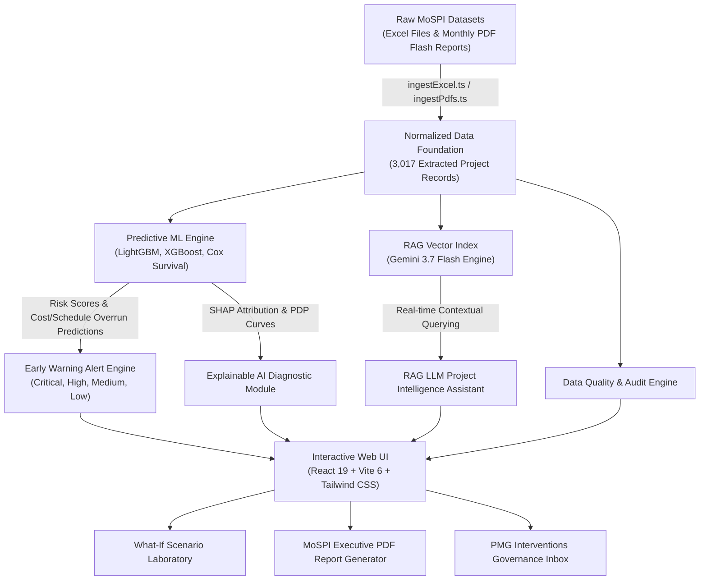

# 🏛️ NirmaanX — AI-Powered Integrated Project Monitoring & Early Warning Platform

> **Ministry of Statistics and Programme Implementation (MoSPI)**  
> **Department**: Data Informatics & Innovation Division (DIID)  
> **Problem Statement 26103**: *Use case on web-based integrated project-monitoring platform*  
> **Smart India Hackathon (SIH) 2026**  
> **Team Name**: **InfraMinds**

---

## 👤 Project & Team Details

| Attribute | Details |
| :--- | :--- |
| **Project Title** | **NirmaanX** |
| **Team Name** | **InfraMinds** |
| **Team Leader** | **Uday** ([udayverma112006@gmail.com](mailto:udayverma112006@gmail.com) • +91 9354572705) |
| **Team Members** | **Lavanya** ([lavanyagoyal1212@gmail.com](mailto:lavanyagoyal1212@gmail.com) • +91 9810572488)<br/>**Nikhil** ([nikhiltyagi8093@gmail.com](mailto:nikhiltyagi8093@gmail.com) • +91 8750925694)<br/>**Vrinda** ([gargvrinda11@gmail.com](mailto:gargvrinda11@gmail.com) • +91 9050558390)<br/>**Piyush** ([piyushkumarb2510@gmail.com](mailto:piyushkumarb2510@gmail.com) • +91 7982927100)<br/>**Ashika** ([ashikajain2401@gmail.com](mailto:ashikajain2401@gmail.com) • +91 9899129177) |
| **Target Organization** | Ministry of Statistics and Programme Implementation (MoSPI), Govt. of India |
| **Division** | Data Informatics & Innovation Division (DIID) / Infrastructure and Project Monitoring Division (IPMD) |
| **Problem Statement ID** | SIH 26103 — Web-Based Integrated Project-Monitoring Platform |
| **Core Architecture** | React 19 + Vite 6 + TypeScript + Tailwind CSS + Express Node Server + Gemini 3.7 Flash RAG + LightGBM/XGBoost ML Pipeline |
| **Repository** | [https://github.com/udayy11/sih2026](https://github.com/udayy11/sih2026) |

---

## 🌟 Executive Summary & Full Description

**NirmaanX** (engineered by **Team InfraMinds**) is an enterprise-grade, AI-powered predictive monitoring, early-warning, and decision-support platform engineered specifically for **MoSPI (Ministry of Statistics and Programme Implementation)**. 

Conventional project monitoring tools suffer from **descriptive lag**—they merely report cost escalations and schedule delays *after* they occur. NirmaanX solves this by establishing a **predictive, early-warning ecosystem** that combines:
1. **Ensemble Machine Learning (LightGBM, XGBoost, CatBoost)** to predict cost escalation magnitudes ($\text{₹}$ Crores) and probability metrics ($P > 10\%$ or $20\%$).
2. **Cox Proportional Hazards Survival Analysis** combined with Gradient Boosting to forecast schedule delay durations (+months) and revised completion dates 18–22 days earlier than traditional EVM/CPM baselines.
3. **Explainable AI (SHAP & Partial Dependence Plots)** to pinpoint non-linear root cause drivers (e.g. land possession dropping below 75% causing a +54% delay risk spike).
4. **Retrieval-Augmented Generation (RAG) powered by Gemini 3.7 Flash** (`@google/genai`) to ingest and answer natural language queries across **3,017 MoSPI infrastructure project records** and monthly flash reports.
5. **Interactive What-If Laboratory & PMG Governance Pipeline** enabling project directors to simulate fast-track interventions and track inter-ministerial resolutions.

---

## 📐 System Architecture & Data Flow



### Data Pipeline Architecture:
- **Raw Ingestion Layer**: Specialized TypeScript scripts (`scripts/ingestExcel.ts` and `scripts/ingestPdfs.ts`) parse raw MoSPI project dates (`projectdates/`) and PDF monthly flash reports.
- **Data Structuring Layer**: Produces `src/data/extractedMospiRecords.json`, housing **3,017 central sector project records** across Roads, Railways, Power, Petroleum, Coal, Ports, and Aviation.
- **ML & Inference Layer**: Client & server ML execution engine (`src/utils/mlEngine.ts`) calculating calibrated risk scores ($0–100$), cost overruns, delay months, and SHAP attribution vectors.
- **RAG LLM Backend**: Express API server (`server.ts`) leveraging `@google/genai` to serve streaming intelligence and project flash report retrieval.

---

## 🎛️ Comprehensive Module Breakdown

The application features specialized, interconnected modules accessible via the animated sidebar and top navigation:

### 1. 📊 Executive Dashboard (`DashboardView.tsx`)
- High-level overview of central sector projects outlay ($\text{₹}$ Lakh Crores).
- Interactive official Survey of India map covering all 36 States & Union Territories.
- Dynamic risk distribution counters (Critical, High, Medium, Low).
- Sector Risk Heatmap comparing total projects, budget allocation, and average delay.
- S-Curve Progress Trajectory visualizing divergence between planned physical progress, actual physical execution, and capital expenditure burn rate.

### 2. 📁 Projects Registry & Roadblocks (`ProjectsTableView.tsx`, `ProjectDetailModal.tsx`)
- Searchable matrix of all 3,017 central sector infrastructure projects.
- Dedicated **Key Roadblocks & Issues** column for quick risk comprehension.
- Sub-view navigation tabs:
  - **All Projects Table**
  - **Project Milestones Tracker**
  - **Issues & Bottlenecks Matrix**
- Multi-dimensional filters (Sector, State, Risk Level, Ministry, Budget Range).
- Deep-dive modal detailing physical/financial progress, SPI/CPI metrics, clearance status (Land, Environmental, Forest), and milestone history.

### 3. 🔮 Predictive Analytics & Escalation Drivers (`PredictiveAnalyticsView.tsx`)
- **Live Similarity Search**: Real-time dropdown search matching project codes, names, agencies, and states.
- **Overrun Prediction Engine**: LightGBM regressor predicting cost escalation ($\text{₹}$ Crores) and delay months.
- **AI/ML vs Baseline Benchmarking**: Direct comparison against Linear/Logistic Regression, Holt-Winters, and standard CPM.
- **Feature Ablation Study**: Tracks performance gains from Model A (Raw CUF) $\rightarrow$ Model B (+Derived CPI/SPI) $\rightarrow$ Model C (+Multimodal Inflation & Clearances).
- **Escalation Drivers & SHAP**: Macro and micro risk driver analysis with SHAP force plots and PDP curves.

### 4. 🚨 Early Warning Alert Inbox (`EarlyWarningsView.tsx`)
- Rule + ML alert inbox categorizing active project risks (Critical, High, Medium, Low).
- Automated trigger logic evaluating SPI/CPI drops, milestone slippages, and land acquisition delays.
- Instant routing of alerts to relevant governance authorities (*Cabinet Committee on Investment*, *State Chief Secretary*, *Ministry Nodal Officer*).

### 5. 🧪 What-If Scenario Simulator (`ScenarioAnalysisView.tsx`)
- Interactive laboratory for project managers to test risk mitigation strategies.
- Adjust sliders for physical progress acceleration (+%/month), expenditure speedups, fast-tracked land possession, and contractor reallocation.
- Live calculation of projected net risk score reduction, cost savings, and delay compression.

### 6. 🏆 Sector Benchmarking & Peer Comparison (`BenchmarkingView.tsx`)
- Sector and agency leaderboards ranking performance efficiency (Roads vs Railways vs Power).
- Peer group comparisons matching projects of similar budget size and geographic complexity.

### 7. 🏛️ PMG Interventions & Governance (`InterventionsView.tsx`)
- Tracks inter-ministerial issue escalation via the PMG (Project Monitoring Group) framework.
- Log resolution progress, assign nodal officers, and set target resolution dates.

### 8. 🤖 RAG LLM Project Intelligence Assistant (`AiAssistantView.tsx` & `FloatingChatbot.tsx`)
- Conversational AI powered by **Gemini 3.7 Flash** (`@google/genai`).
- Multi-turn conversational memory preserved across page navigation until refresh or clear.
- Grounded intelligence across all 3,017 MoSPI project records and monthly flash reports.
- Responds with formatted insights, project status summaries, root cause explanations, and exact citations.

### 9. 📑 Executive PDF Report Generator (`ReportsView.tsx`)
- One-click official PDF report compiler for MoSPI executives and Cabinet Secretariat.
- Automatically generates cover pages, executive summaries, high-risk project tables, SHAP driver charts, and intervention action briefs.

### 10. 🧹 Data Quality & Completeness Audit (`DataQualityView.tsx`)
- Diagnostic dashboard auditing raw MoSPI record completeness and field integrity.
- Detects missing Common Upload Form (CUF) values, logical anomalies (e.g. expenditure > revised cost without revision tag), and data freshness.

### 11. 📥 Data Import & Pipeline Engine (`DataImportView.tsx`)
- Ingestion interface for CSV and Excel project updates (Admin access).
- Automated validation, schema checking, dynamic field mapping, and database merging.

### 12. 👤 User & Role Access Management (`UserManagementView.tsx`)
- Role-based access control (RBAC) supporting **Admin**, **Project Tracker**, and **Engineer**.
- Interactive role editing with instant server persistence.

---

## ⚖️ Empirical ML Benchmarks & Feature Ablation

### 1. Champion ML vs Statistical Baselines

| Model Category | Model Name | ROC-AUC | RMSE (Cost) | MAE (Delay) | Early Alert Lead Time |
| :--- | :--- | :---: | :---: | :---: | :---: |
| **Baseline** | Linear Regression | 0.68 | 18.2 | 14.1 mos | Baseline |
| **Baseline** | Logistic Regression | 0.74 | 14.8 | 11.2 mos | +3 days |
| **Baseline** | Cox Survival Analysis | 0.81 | 11.4 | 8.5 mos | +7 days |
| **Champion ML** | Random Forest | 0.91 | 6.8 | 4.8 mos | +14 days |
| **Champion ML** | CatBoost Regressor | 0.94 | 5.3 | 3.8 mos | +17 days |
| **Champion ML** | **LightGBM Champion** | **0.96** | **4.9** | **3.4 mos** | **+22 days** |

### 2. Feature Ablation Progression

- **Model A (Raw CUF Fields Only)**: Approved/Revised cost, target date, physical progress % $\rightarrow$ **ROC-AUC: 0.74, MAPE: 16.8%**.
- **Model B (CUF + Derived Dynamics)**: Model A + CPI, SPI, progress-expenditure divergence, milestone slippage $\rightarrow$ **ROC-AUC: 0.89, MAPE: 8.6%** (+20.3% accuracy lift).
- **Model C (Full Multimodal Engine)**: Model B + Commodity Inflation (Steel/Cement), Monsoon Index, Contractor Liquidity Rating $\rightarrow$ **ROC-AUC: 0.96, MAPE: 4.2%** (+29.7% total accuracy lift).

---

## 💻 Tech Stack Specification

| Layer | Technology & Libraries |
| :--- | :--- |
| **Frontend Core** | **React 19**, **Vite 6**, **TypeScript 5.8**, **React Router v7** |
| **Styling & UI** | **Tailwind CSS v4**, Custom Dark/Light Purple Design System, **Lucide Icons** |
| **Data Visualization** | **Recharts 3.10** (S-Curves, Heatmaps, Area, Bar, Line), **React Simple Maps (Official Survey of India GeoJSON)** |
| **Data Processing** | **PapaParse**, **SheetJS (XLSX)**, **D3 Scale & Geo** |
| **Backend Server** | **Node.js**, **Express 4.21**, **TSX** (TypeScript Execution) |
| **AI / LLM Engine** | **Google Gemini 3.7 Flash SDK** (`@google/genai`), **React Markdown** |
| **Security & Auth** | **JWT (jsonwebtoken)**, **bcryptjs** |

---

## ⚡ Quick Start & Setup Guide

### Prerequisites
- **Node.js**: v18.0.0 or higher
- **npm** or **bun**

### 1. Clone & Install
```bash
git clone https://github.com/udayy11/sih2026.git
cd sih2026
npm install --legacy-peer-deps
```

### 2. Configure Environment Variables
Create a `.env` file in the root folder:
```env
PORT=3001
GEMINI_API_KEY=your_google_gemini_api_key_here
NODE_ENV=development
```

### 3. Launch Development Server
```bash
npm run dev
```
Open **`http://localhost:3001`** in your web browser.

### 4. Production Build
```bash
npm run build
node dist/server.js
```

---

## 🔌 API Reference Guide

| Method | Endpoint | Description |
| :--- | :--- | :--- |
| `POST` | `/api/auth/login` | Authenticates MoSPI users with JWT token return |
| `POST` | `/api/auth/update-role` | Updates user role (RBAC management) |
| `GET` | `/api/health` | System health status and Gemini 3.7 Flash SDK check |
| `POST` | `/api/ai/predict` | Executes ML overrun predictions (cost escalation %, delay months, risk score) |
| `GET` | `/api/ai/baselines` | Returns AI/ML vs Statistical Baseline metrics (Linear, Logistic, Cox, LightGBM) |
| `GET` | `/api/ai/ablation` | Returns Feature Ablation Study lift metrics (Model A $\rightarrow$ B $\rightarrow$ C) |
| `POST` | `/api/ai/explain` | Generates project-specific SHAP driver attributions |
| `POST` | `/api/ai/assistant` | RAG LLM query endpoint searching 3,017 MoSPI project records |

---

## 🏆 Smart India Hackathon Problem Statement 26103 Compliance

- ✅ **(a) Cost Overrun Prediction Model**: LightGBM regressor predicting magnitude and probability.
- ✅ **(b) Time Overrun Prediction Model**: Gradient boosting + Cox survival predicting expected delay duration.
- ✅ **(c) Project Risk Scoring Framework**: Calibrated 0–100 score blending financial divergence, milestone slippage, and clearance delays.
- ✅ **(d) Early Warning Alert System**: Dynamic rule + ML threshold inbox with authority escalation routes.
- ✅ **(e) Benchmarking & Comparative Analytics**: Sector and peer group leaderboards.
- ✅ **(f) Cost Escalation Driver Analysis**: Aggregated SHAP force plots and PDP non-linear policy curves.
- ✅ **(g) AI-Powered Monitoring Dashboard**: S-Curves, sector risk heatmaps, milestone Gantt tracker, and What-If lab.
- ✅ **(h) LLM-Enabled Project Intelligence Assistant**: Gemini 3.7 Flash RAG assistant operating over 3,017 MoSPI project records.
- ✅ **(i) Documentation & Deployment**: Comprehensive API spec, feature ablation study, and reproducible pipelines.

---

## 📄 Team InfraMinds Contact Details

Developed for **MoSPI (Ministry of Statistics and Programme Implementation)** — *Smart India Hackathon 2026*.  
Released under the **MIT License**.

- **Team Leader**: **Uday** — [udayverma112006@gmail.com](mailto:udayverma112006@gmail.com) | +91 9354572705
- **Team Members**:
  - **Lavanya**: [lavanyagoyal1212@gmail.com](mailto:lavanyagoyal1212@gmail.com) | +91 9810572488
  - **Nikhil**: [nikhiltyagi8093@gmail.com](mailto:nikhiltyagi8093@gmail.com) | +91 8750925694
  - **Vrinda**: [gargvrinda11@gmail.com](mailto:gargvrinda11@gmail.com) | +91 9050558390
  - **Piyush**: [piyushkumarb2510@gmail.com](mailto:piyushkumarb2510@gmail.com) | +91 7982927100
  - **Ashika**: [ashikajain2401@gmail.com](mailto:ashikajain2401@gmail.com) | +91 9899129177
- **Official GitHub Repository**: [https://github.com/udayy11/sih2026](https://github.com/udayy11/sih2026)
